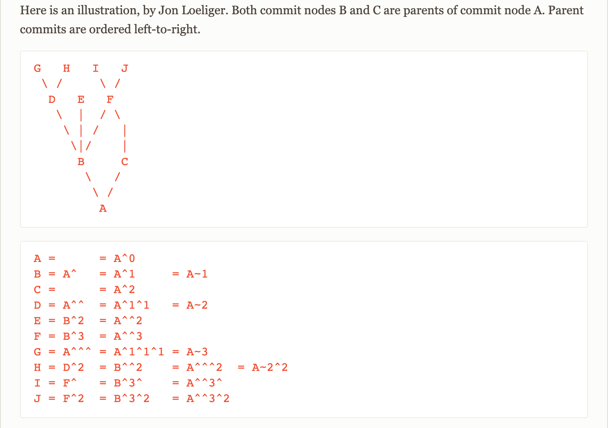
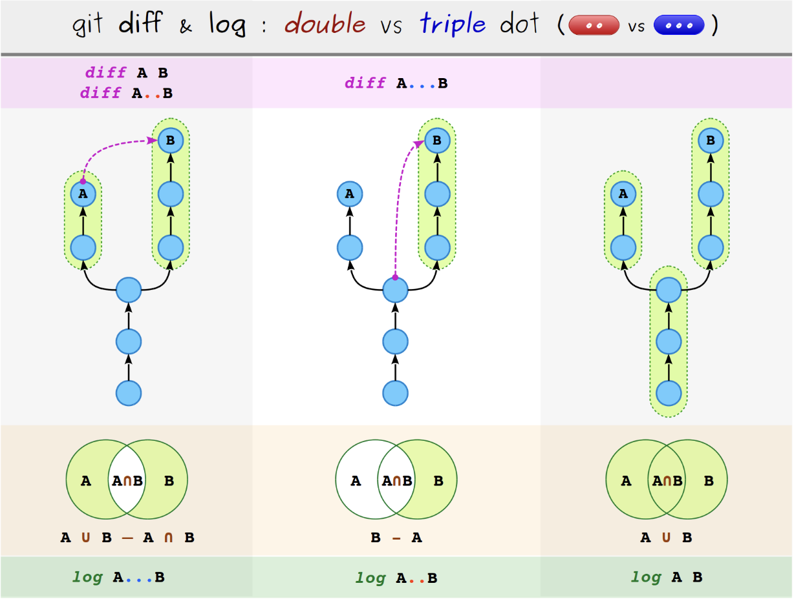

# ^と~の違い

[参考リンク](https://stackoverflow.com/questions/2221658/whats-the-difference-between-head-and-head-in-git)

# 任意のラインを変更したログを検索

```
> git log -L START_LINE,END_LINE:FILENAME
```

`git blame`でもいい

# コミットの特定のファイルのみCherry-pick

[参考リンク](https://codehero.jp/git/5717026/how-to-git-cherry-pick-only-changes-to-certain-files)

```
> git cherry-pick -n <commit-id>
```

# Revert

Revertの仕方

# 2ドットと３ドット



> git diff A...B = git diff $(git merge-base A B) B